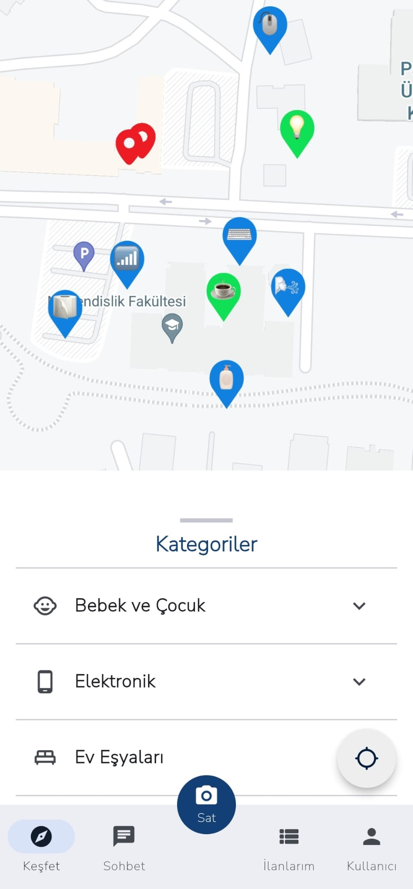

# Mapemo

It is a flutter application and an e-commerce project that allows you to buy stuff more efficently.

## Screenshots
<table>
  <tr>
     <td>Register Screen</td>
     <td>Sign In Screen</td>
  </tr>
  <tr>
     <td width="33%"></td>
     <td width="33%"></td>
  </tr>
 </table>

<table>
  <tr>
     <td>Explore Screen</td>
     <td>Detailed Advert Screen</td>
     <td>Categories Screen</td>
    
  </tr>
  <tr>
     <td width="33%"></td>
     <td width="33%"></td>
     <td width="33%"></td>
  </tr>
 </table>
<table>
  <tr>
     <td>Add Advert Screen</td>
     <td>My Listings Screen</td>
     <td>Chat Screen</td>
  </tr>
  <tr>
     <td width="33%"></td>
     <td width="33%"></td>
     <td width="33%"></td>
  </tr>
 </table>
